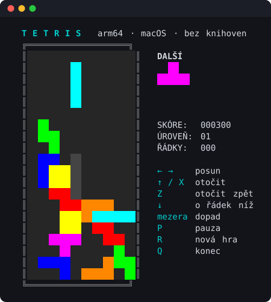

# Tetris v ARM64 assembleru

Klasický Tetris pro terminál, napsaný celý v assembleru ARM64 pro macOS na Apple Silicon.
Program nevolá žádnou funkci z libc ani z jiné knihovny — veškerá komunikace s okolím jde
přímo přes BSD syscally instrukcí `svc #0x80`.



## Vlastnosti

* Hrací plocha 10 × 20 polí, sedm klasických dílků v 256barevném ANSI provedení
* Generátor kusů typu „pytel“ — každá sedmice obsahuje všech sedm tvarů v náhodném pořadí
  (míchání algoritmem Fisher–Yates, zdroj náhody je xorshift32 osazený z `gettimeofday`)
* Náhled místa dopadu („duch“) a náhled následujícího dílku
* Otáčení oběma směry včetně odsunutí od stěny (*wall kick* o −1, +1, −2 nebo +2 sloupce)
* Okamžitý pád, pauza, restart a skóre s postupem úrovní
* Žádné závislosti: jediný zdrojový soubor, žádný běhový systém, žádná knihovna

## Požadavky

* Mac s procesorem Apple Silicon (arm64)
* Nainstalované Xcode Command Line Tools (`xcode-select --install`) — kvůli `clang`, `ld` a SDK
* Terminál s podporou 256 barev a alespoň 24 řádky výšky

## Překlad

```sh
./build.sh
```

Skript přeloží `tetris.s`, slinkuje ho a podepíše ad-hoc podpisem. Výsledkem je spustitelný
soubor `tetris` v kořeni projektu.

Program sice žádnou funkci z libSystem nevolá, ale na Apple Silicon musí být i „bezknihovní“
binárka natažena dynamickým linkerem — proto se na libSystem přesto odkazuje.

Pokud překlad skončí chybou kvůli verzi systému, uprav v `build.sh` hodnoty u přepínače
`-platform_version` podle své verze macOS.

## Spuštění

```sh
./tetris
```

Hra si terminál přepne do „raw“ režimu a při ukončení ho vrátí do původního stavu.

## Ovládání

| Klávesa | Akce |
| --- | --- |
| `←` `→` nebo `A` `D` | posun dílku do stran |
| `↑`, `X` nebo `W` | otočení po směru hodinových ručiček |
| `Z` | otočení proti směru hodinových ručiček |
| `↓` nebo `S` | posun o řádek níž |
| `mezerník` | okamžitý pád na dno |
| `P` | pauza |
| `R` | nová hra |
| `Q` nebo `Ctrl-C` | konec |

## Bodování a obtížnost

Za smazané řádky se přičítá 100, 300, 500 nebo 800 bodů podle toho, kolik jich padne najednou;
výsledek se násobí aktuální úrovní. Okamžitý pád přidá 2 body za každý propadlý řádek.

Úroveň stoupá o jednu po každých deseti smazaných řádcích, nejvýše na patnáctou. S úrovní
zrychluje padání: hra běží v ticích po 20 ms a na jeden pád jich připadá `26 − 2 × úroveň`,
nejméně však dva. Na první úrovni tedy dílek klesne po 480 ms, na patnácté po 40 ms.

## Jak to funguje

Program si vystačí se šesti syscally:

| Syscall | Číslo | K čemu slouží |
| --- | --- | --- |
| `exit` | 1 | ukončení programu |
| `read` | 3 | čtení kláves ze standardního vstupu |
| `write` | 4 | vykreslení snímku na standardní výstup |
| `ioctl` | 54 | přepnutí terminálu do raw režimu (`TIOCGETA` / `TIOCSETA`) |
| `select` | 93 | čekání na klávesu s časovým limitem 20 ms |
| `gettimeofday` | 116 | osazení generátoru náhodných čísel |

Vykreslování je řešeno ANSI escape sekvencemi. Celý snímek se nejprve poskládá do vyrovnávací
paměti a na terminál se pošle jediným zápisem, takže obraz neproblikává. Dílky jsou uloženy
jako 16bitové masky mřížky 4 × 4 — jedna maska pro každou ze čtyř rotací.

## Struktura projektu

| Soubor | Obsah |
| --- | --- |
| `tetris.s` | kompletní zdrojový kód hry |
| `build.sh` | překlad, slinkování a podepsání binárky |
| `docs/screenshot.svg` | snímek obrazovky ze hry |
| `LICENSE` | text licence Apache 2.0 |

## Licence

Projekt je uvolněn pod licencí Apache 2.0, její plné znění je v souboru [`LICENSE`](LICENSE).
